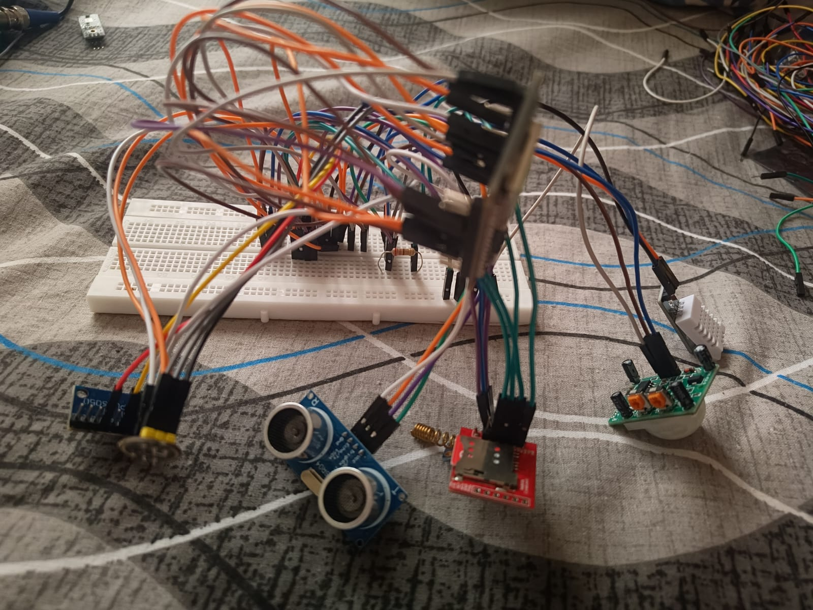
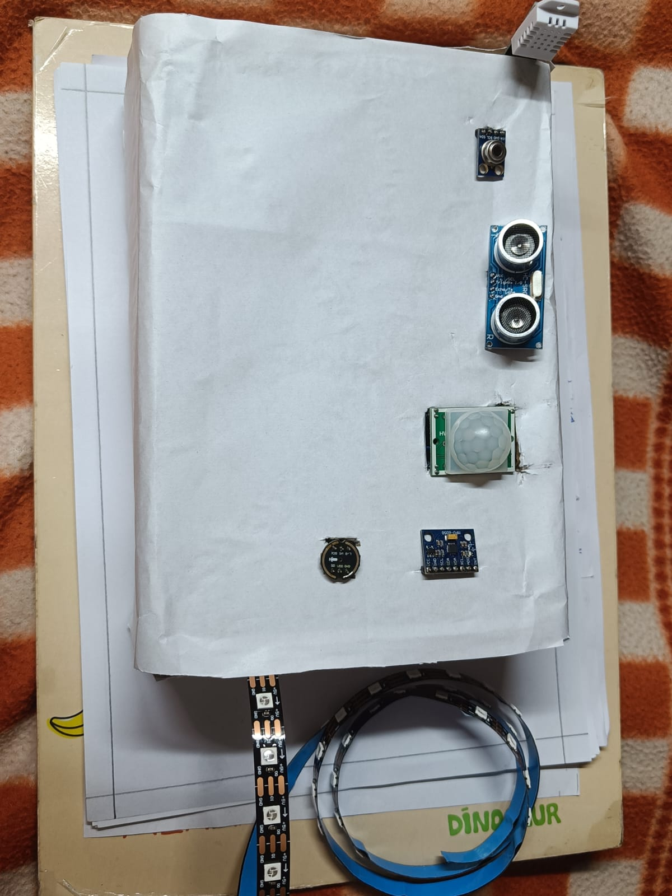

# HAVEN SENSE
### Privacy-Preserving Environmental and Behavioural Monitoring Prototype for Mental-Health Care

HAVEN SENSE is an ESP32-based prototype designed around a simple idea:

> **Monitor the patient's room and behavioural/environmental changes without requiring a caretaker to remain beside the patient continuously.**

The project was developed as a proof-of-concept for situations where continuous physical observation may make patients uncomfortable or compromise their privacy.

Instead of relying only on direct physiological measurements, the prototype combines room/environmental sensing and non-invasive behavioural indicators such as motion, pressure, distance and sound. The ESP32 processes the readings locally and provides a simple response through soft ambient lighting and audio.

---

## Why this project?

Continuous observation can be useful in mental-health care, but having a nurse or caretaker physically present 24×7 can also make some patients uncomfortable.

HAVEN SENSE explores a less intrusive alternative:

**Sensors → ESP32 → local interpretation → ambient feedback / future remote alert**

The intended system can:

- observe movement and activity in the room
- monitor environmental temperature and humidity
- detect pressure/activity through FSR sensors
- estimate proximity using an ultrasonic sensor
- monitor sound intensity
- provide calming ambient LED feedback
- play predefined audio responses
- support future remote emergency notifications

### Important scope note

This prototype is a **student proof-of-concept**, not a clinical diagnostic or emergency medical device.

The current code does **not** directly measure oxygen concentration or CO₂ concentration, because dedicated O₂/CO₂ sensors are not present in the implemented sensor set. Those measurements are a future extension.

Similarly, the GSM module was attempted but the available modules were faulty, so GSM/SMS transmission is **not implemented in the current code**. The ESP32's Wi-Fi capability can be used for a future cloud/API-based alert system.

---

## System Architecture

```text
                 ┌─────────────────────────────┐
                 │        PATIENT ROOM         │
                 │                             │
                 │  DHT22 ── Temperature/     │
                 │            Humidity         │
                 │  PIR ──── Motion           │
                 │  FSR ──── Pressure/Activity│
                 │  HC-SR04 ─ Distance         │
                 │  I2S Mic ─ Sound Level      │
                 │  MLX90614 ─ IR Temperature  │
                 │  MPU6050 ─ Motion/IMU       │
                 └─────────────┬───────────────┘
                               │
                               ▼
                     ┌──────────────────┐
                     │      ESP32       │
                     │                  │
                     │ Sensor reading   │
                     │ Local processing │
                     │ Rule-based state │
                     └───────┬──────┬───┘
                             │      │
                    ┌────────┘      └─────────┐
                    ▼                          ▼
          ┌─────────────────┐        ┌─────────────────┐
          │ NeoPixel LEDs   │        │   DFPlayer Mini │
          │ Ambient feedback│        │ Pre-recorded    │
          │                 │        │ audio feedback  │
          └─────────────────┘        └─────────────────┘

                 Future communication layer
                             │
                             ▼
                  Wi-Fi / GSM / Cloud API
                             │
                             ▼
                    Emergency Contact
```

---

## Hardware Used

| Component | Purpose |
|---|---|
| ESP32 | Main microcontroller and local processing |
| DHT22 | Room temperature and humidity |
| PIR sensor | Detects motion/activity |
| FSR pressure sensor ×2 | Detects pressure/activity |
| HC-SR04 | Distance/proximity estimation |
| I2S microphone | Sound-level sensing |
| MLX90614 | Non-contact IR temperature sensing |
| MPU6050 | Accelerometer/gyroscope; included in hardware prototype |
| NeoPixel RGB strip | Soft ambient visual feedback |
| DFPlayer Mini | Audio playback |
| GSM/SIM module | Intended SMS alert path; hardware was faulty during testing |
| Photodiode | Included in the component set; not used by the current sketch |

### Components visible in the prototype photographs

The attached photographs show the ESP32/breadboard setup and the room-model arrangement containing the ultrasonic sensor, PIR sensor, temperature/humidity sensor, IR temperature module, FSR, MPU6050, LED strip and related wiring.

---

## Pin Configuration Used by the Current Code

| Device | ESP32 Pin |
|---|---:|
| DHT22 data | GPIO 4 |
| FSR analog output | GPIO 34 |
| PIR output | GPIO 14 |
| HC-SR04 TRIG | GPIO 32 |
| HC-SR04 ECHO | GPIO 33 |
| NeoPixel data | GPIO 27 |
| I2S microphone WS/LRCLK | GPIO 13 |
| I2S microphone SD/DOUT | GPIO 35 |
| I2S microphone SCK/BCLK | GPIO 12 |
| DFPlayer RX connection | GPIO 16 |
| DFPlayer TX connection | GPIO 17 |
| I2C SDA | ESP32 default SDA |
| I2C SCL | ESP32 default SCL |

**Note:** The pin table above reflects the software configuration in the submitted sketch. The photographs are prototype wiring photographs and should not be treated as a verified schematic.

---

## Current Detection Logic

The current prototype uses a simple rule-based decision system.

```text
Sound level > 2000
        ↓
     ANXIETY

Else if FSR pressure > 2000
        ↓
      STRESS

Else if no PIR motion detected
        ↓
     DISTRESS

Else
        ↓
      CALM
```

The detected state then controls the local feedback:

| State | LED response | Audio |
|---|---|---|
| Calm | Blue | Track 1 |
| Stress | Yellow | Track 2 |
| Anxiety | Red | Track 3 |
| Distress | Purple | Track 4 |

These states are **prototype labels based on sensor thresholds**. They should not be interpreted as medical diagnoses.

---

## Prototype Photos

### Breadboard / wiring prototype



### Room-model sensor arrangement



---

## Software

The project is written for the ESP32 using the Arduino IDE.

### Libraries

- Wire
- DHT
- Adafruit MLX90614
- MPU6050
- Adafruit NeoPixel
- ESP32 I2S driver
- DFRobotDFPlayerMini

### Current processing flow

```text
Read DHT22
     ↓
Read MLX90614
     ↓
Read FSR
     ↓
Read PIR
     ↓
Measure HC-SR04 distance
     ↓
Read I2S microphone
     ↓
Apply rule-based thresholds
     ↓
Select state
     ↓
Change LED colour + play audio
     ↓
Print sensor status to Serial Monitor
```

---

## Current Limitations

The present implementation is intentionally a proof-of-concept.

1. **GSM/SMS is not implemented.** The GSM modules available during development were faulty.
2. **Wi-Fi alerting is not present in this sketch yet.** It is a planned communication extension using the ESP32's built-in Wi-Fi.
3. **O₂ and CO₂ are not measured.** Dedicated gas sensors would be required.
4. **MPU6050 is initialized but its readings are not currently used in the emotion/state decision logic.**
5. **Only one FSR input is read in the current sketch**, although two FSR sensors were available.
6. **The photodiode is not used in the current sketch.**
7. The emotion classification is **rule-based**, not an AI/ML clinical emotion-recognition model.
8. Sensor thresholds need calibration for a real room and real operating conditions.
9. The current prototype does not provide medical diagnosis or guaranteed emergency detection.

---

## Future Improvements

### 1. Remote emergency notification
Add Wi-Fi connectivity to send an event to a server/API or messaging service.

### 2. Dedicated environmental gas sensing
Add calibrated O₂ and CO₂ sensors if environmental gas monitoring is required.

### 3. Better signal processing
Use moving averages, filtering and multi-sensor fusion instead of single threshold comparisons.

### 4. Use the MPU6050 and both FSRs
Combine multiple activity indicators to reduce false alarms.

### 5. Event logging
Store timestamped sensor data locally or on a server for later analysis.

### 6. Adaptive thresholds
Learn the normal baseline of a room/patient environment instead of using fixed values.

### 7. Privacy-first architecture
Keep raw sensor data local whenever possible and transmit only meaningful events or derived features.

### 8. Clinical validation
Any real healthcare deployment would require proper clinical validation, safety testing, privacy controls and regulatory review.

---

## Repository Structure

```text
Haven-Sense/
├── README.md
├── REPORT.md
├── src/
│   └── HavenSense.ino
├── docs/
│   └── connection-notes.md
└── images/
    ├── prototype-breadboard.jpg
    └── prototype-layout.jpg
```

---

## Code

The complete current Arduino/ESP32 sketch is included in:

`src/HavenSense.ino`

The same code is reproduced below for quick reference.

<details>
<summary><strong>Click to view the complete ESP32 code</strong></summary>

```cpp
#include <Wire.h>
#include <DHT.h>
#include <Adafruit_MLX90614.h>
#include <MPU6050.h>
#include <Adafruit_NeoPixel.h>
#include "driver/i2s.h"
#include <DFRobotDFPlayerMini.h>

// ================= SENSOR PINS =================

#define DHTPIN 4
#define DHTTYPE DHT22

#define FSR_PIN 34
#define PIR_PIN 14

#define TRIG_PIN 32
#define ECHO_PIN 33

// ================= NEOPIXEL =================

#define LED_PIN 27
#define NUM_LEDS 10

// ================= I2S MICROPHONE =================

#define I2S_WS 13
#define I2S_SD 35
#define I2S_SCK 12

// ================= DFPLAYER =================

#define DF_RX 16
#define DF_TX 17

// ================= OBJECTS =================

DHT dht(DHTPIN, DHTTYPE);
Adafruit_MLX90614 mlx = Adafruit_MLX90614();
MPU6050 mpu;

Adafruit_NeoPixel strip(
  NUM_LEDS,
  LED_PIN,
  NEO_GRB + NEO_KHZ800
);

HardwareSerial dfSerial(1);
DFRobotDFPlayerMini dfPlayer;

// ================= SENSOR VARIABLES =================

float temperature;
float humidity;
float bodyTemp;
float distance;

int pressureValue;
int soundLevel;
int motionDetected;

// ================= I2S SETUP =================

void setupI2S()
{
  const i2s_config_t i2s_config = {
    .mode = (i2s_mode_t)(I2S_MODE_MASTER | I2S_MODE_RX),
    .sample_rate = 16000,
    .bits_per_sample = I2S_BITS_PER_SAMPLE_32BIT,
    .channel_format = I2S_CHANNEL_FMT_ONLY_LEFT,
    .communication_format = I2S_COMM_FORMAT_I2S,
    .intr_alloc_flags = ESP_INTR_FLAG_LEVEL1,
    .dma_buf_count = 8,
    .dma_buf_len = 64,
    .use_apll = false
  };

  const i2s_pin_config_t pin_config = {
    .bck_io_num = I2S_SCK,
    .ws_io_num = I2S_WS,
    .data_out_num = I2S_PIN_NO_CHANGE,
    .data_in_num = I2S_SD
  };

  i2s_driver_install(
    I2S_NUM_0,
    &i2s_config,
    0,
    NULL
  );

  i2s_set_pin(
    I2S_NUM_0,
    &pin_config
  );
}

// ================= READ MICROPHONE =================

int readSoundLevel()
{
  int32_t sample = 0;
  size_t bytesRead = 0;

  i2s_read(
    I2S_NUM_0,
    &sample,
    sizeof(sample),
    &bytesRead,
    portMAX_DELAY
  );

  sample = abs(sample);

  return sample / 1000;
}

// ================= SET LED COLOR =================

void setColor(int r, int g, int b)
{
  for(int i = 0; i < NUM_LEDS; i++)
  {
    strip.setPixelColor(
      i,
      strip.Color(r, g, b)
    );
  }

  strip.show();
}

// ================= SETUP =================

void setup()
{
  Serial.begin(115200);

  // Sensor pins
  pinMode(PIR_PIN, INPUT);

  pinMode(TRIG_PIN, OUTPUT);
  pinMode(ECHO_PIN, INPUT);

  // I2C
  Wire.begin();

  // DHT22
  dht.begin();

  // MLX90614
  mlx.begin();

  // MPU6050
  mpu.initialize();

  // I2S microphone
  setupI2S();

  // NeoPixel
  strip.begin();
  strip.show();

  // Startup LED
  setColor(0, 255, 0);
  delay(1000);
  setColor(0, 0, 0);

  // DFPlayer
  dfSerial.begin(
    9600,
    SERIAL_8N1,
    DF_RX,
    DF_TX
  );

  if (dfPlayer.begin(dfSerial))
  {
    Serial.println("DFPlayer connected");

    dfPlayer.volume(20);
    dfPlayer.EQ(DFPLAYER_EQ_NORMAL);
  }
  else
  {
    Serial.println("DFPlayer connection failed");
  }

  Serial.println();
  Serial.println("================================");
  Serial.println("     HAVEN SENSE SYSTEM");
  Serial.println("================================");
  Serial.println("System Started");
}

// ================= MAIN LOOP =================

void loop()
{
  readSensors();

  int predictedEmotion = detectEmotion();

  applyEmotion(predictedEmotion);

  printStatus(predictedEmotion);

  delay(3000);
}

// ================= READ ALL SENSORS =================

void readSensors()
{
  humidity = dht.readHumidity();
  temperature = dht.readTemperature();

  if (isnan(humidity) || isnan(temperature))
  {
    Serial.println("DHT22 ERROR");
  }

  bodyTemp = mlx.readObjectTempC();

  pressureValue = analogRead(FSR_PIN);

  motionDetected = digitalRead(PIR_PIN);

  distance = readDistance();

  soundLevel = readSoundLevel();
}

// ================= ULTRASONIC =================

float readDistance()
{
  digitalWrite(TRIG_PIN, LOW);
  delayMicroseconds(2);

  digitalWrite(TRIG_PIN, HIGH);
  delayMicroseconds(10);

  digitalWrite(TRIG_PIN, LOW);

  long duration = pulseIn(
    ECHO_PIN,
    HIGH,
    30000
  );

  if(duration == 0)
  {
    return 0;
  }

  return duration * 0.034 / 2;
}

// ================= EMOTION DETECTION =================
//
// 0 = Calm
// 1 = Stress
// 2 = Anxiety
// 3 = Distress
//

int detectEmotion()
{
  if(soundLevel > 2000)
  {
    return 2;
  }

  if(pressureValue > 2000)
  {
    return 1;
  }

  if(motionDetected == 0)
  {
    return 3;
  }

  return 0;
}

// ================= EMOTION RESPONSE =================

void applyEmotion(int emotion)
{
  switch(emotion)
  {
    // CALM
    case 0:

      setColor(0, 0, 255);

      // Track 1 = calm audio
      dfPlayer.play(1);

      Serial.println("Emotion: CALM");

      break;


    // STRESS
    case 1:

      setColor(255, 255, 0);

      // Track 2 = stress audio
      dfPlayer.play(2);

      Serial.println("Emotion: STRESS");

      break;


    // ANXIETY
    case 2:

      setColor(255, 0, 0);

      // Track 3 = anxiety audio
      dfPlayer.play(3);

      Serial.println("Emotion: ANXIETY");

      break;


    // DISTRESS
    case 3:

      setColor(80, 0, 120);

      // Track 4 = distress audio
      dfPlayer.play(4);

      Serial.println("Emotion: DISTRESS");

      break;
  }
}

// ================= SERIAL STATUS =================

void printStatus(int emotion)
{
  Serial.println();
  Serial.println("----------- SENSOR DATA -----------");

  Serial.print("Temperature : ");
  Serial.print(temperature);
  Serial.println(" °C");

  Serial.print("Humidity    : ");
  Serial.print(humidity);
  Serial.println(" %");

  Serial.print("Body Temp   : ");
  Serial.print(bodyTemp);
  Serial.println(" °C");

  Serial.print("Pressure    : ");
  Serial.println(pressureValue);

  Serial.print("Sound       : ");
  Serial.println(soundLevel);

  Serial.print("Motion      : ");
  Serial.println(motionDetected);

  Serial.print("Distance    : ");
  Serial.print(distance);
  Serial.println(" cm");

  Serial.print("Emotion     : ");
  Serial.println(emotion);

  Serial.println("-----------------------------------");
}
```

</details>

---

## Project Status

**Prototype stage / proof of concept**

The hardware prototype was assembled and tested with the available sensors. The current implementation demonstrates local sensor acquisition, rule-based state detection, ambient LED feedback, audio playback and serial monitoring.

Remote GSM/SMS notification and dedicated O₂/CO₂ monitoring remain future development items.

## My Contribution

This was a group project. My primary contribution was the hardware
implementation and prototype development.

I worked on:
- Sensor selection and hardware integration
- ESP32 and sensor wiring
- Breadboard prototyping and hardware testing
- Integration of the RGB LED and other output components
- Hardware-level debugging and troubleshooting
- Understanding and testing the embedded software with the hardware

I also studied and understood the main software flow, including sensor
acquisition, threshold-based state detection, and output control.

## Author

**Sudeshna Patra**  
B.Tech — Electronics and Communication Engineering

This repository documents an independent student prototype and its current implementation status.
